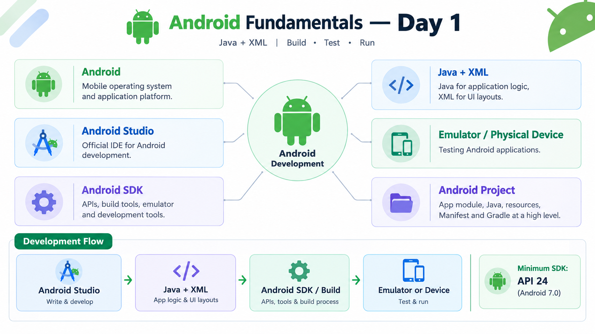

# Android Fundamentals — Day 1

## Overview

Day 1 focused on understanding the fundamentals of Android development and the tools required to build Android applications using **Java and XML**.

## Topics Learned

### 1. Android

Android is a mobile operating system and application platform used to develop applications for smartphones, tablets, TVs, watches, automotive systems, and other devices.

### 2. Android Studio

Android Studio is the official IDE used for Android application development.

It provides:

* Code editor
* XML layout editor
* Emulator support
* Debugging tools
* Build and Gradle integration
* Android SDK management

### 3. Android SDK

SDK stands for **Software Development Kit**.

The Android SDK provides the tools and APIs required to develop, build, test, and run Android applications.

It includes:

* Android APIs
* Build tools
* Platform tools
* Emulator tools
* SDK platforms

### 4. Java + XML

This learning journey uses:

* **Java** → application logic and behavior
* **XML** → user interface layouts and UI structure

Java and XML work together to create Android applications.

### 5. Emulator and Physical Device

An **Android Emulator** is a virtual Android device that runs on a computer and allows applications to be tested without a physical phone.

A **physical Android device** can also be used for testing, usually through USB debugging.

### 6. Minimum SDK

The project was created with:

**Minimum SDK: API 24 — Android 7.0**

The Minimum SDK defines the oldest Android version that the application supports.

It does **not** mean that Android Studio or the computer is running Android 7.0.

## Android Development Flow

**Android Studio → Java + XML → Android SDK / Build → Emulator or Physical Device**

## Project Created

* Project type: **Empty Views Activity**
* Language: **Java**
* UI: **XML**
* Minimum SDK: **API 24**
* IDE: **Android Studio**

## Key Understanding

The basic Android development environment consists of:

**Android Studio**
↓
**Java + XML**
↓
**Android SDK & Build System**
↓
**Android Application**
↓
**Emulator / Physical Device**

## Day 1 Outcome

By the end of Day 1, I understood the basic Android ecosystem, Android Studio, Android SDK, emulator/physical device testing, Minimum SDK, and the high-level structure of an Android project.