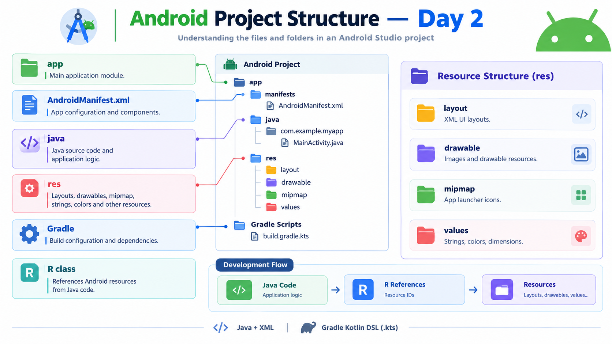

# Android Project Structure — Day 2



## Overview

Day 2 focused on understanding the internal structure of an Android project and the purpose of its main folders and build files.

## Topics Learned

### 1. App Module

The `app` module contains the main application code and resources.

It includes:
- Java source code
- XML layouts
- Resources
- AndroidManifest.xml
- App-level Gradle configuration

### 2. AndroidManifest.xml

The Manifest file provides important information about the application to the Android system.

It can define:
- Application information
- Activities
- Permissions
- Services
- Other application components

### 3. Java

The Java source folder contains the application's Java classes.

Java is used for:
- Application logic
- Activity behavior
- Event handling
- Data processing

Example:

`MainActivity.java`

### 4. Resources (`res`)

The `res` folder contains application resources that are separate from Java code.

Important resource folders include:

- `layout` → XML user interfaces
- `drawable` → Images and drawable resources
- `mipmap` → Application launcher icons
- `values` → Strings, colors, dimensions and other values

### 5. Gradle

Gradle is the build system used by Android projects.

It manages:
- Building the application
- Dependencies
- SDK configuration
- Plugins
- Build settings

The project uses **Gradle Kotlin DSL**, so files can have the `.kts` extension.

**Important:** `.kts` does not mean the Android application is written in Kotlin. This project uses **Java for application code**.

### 6. Generated Resources — R

Android generates an `R` class that provides references to application resources.

For example:

`R.layout.activity_main`

references an XML layout.

`R.id.loginButton`

references a view with the ID `loginButton`.

`R.string.app_name`

references a string resource.

## High-Level Project Structure

```text
AndroidLearning/
│
├── app/
│   ├── manifests/
│   │   └── AndroidManifest.xml
│   │
│   ├── java/
│   │   └── MainActivity.java
│   │
│   ├── res/
│   │   ├── layout/
│   │   ├── drawable/
│   │   ├── mipmap/
│   │   └── values/
│   │
│   └── build.gradle.kts
│
├── build.gradle.kts
├── settings.gradle.kts
└── gradle/