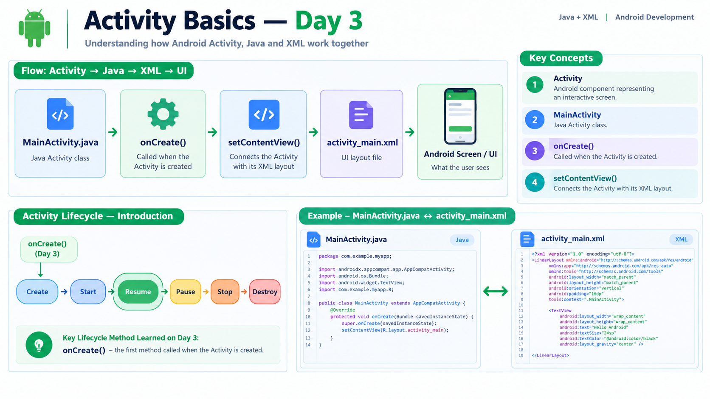

# Activity Basics — Day 3

## Overview

Day 3 focused on understanding Activities, `MainActivity`, connecting Java with XML using `setContentView()`, and the basic Activity lifecycle.

## Topics Learned

### 1. What is an Activity?

An Activity is an Android component that represents a screen where the user can interact with the application.

Examples:

- Login screen → `LoginActivity`
- Home screen → `HomeActivity`
- Profile screen → `ProfileActivity`

An Activity is responsible for handling the behavior and interaction of its screen.

### 2. MainActivity

`MainActivity.java` is the Java Activity class created as the starting Activity of the application.

It contains the Java logic associated with the main screen.

An Activity can work together with an XML layout:

**Java Activity → Screen Behavior**

**XML Layout → Screen UI**

### 3. setContentView()

The `setContentView()` method connects an Activity with its XML layout.

Example:

`setContentView(R.layout.activity_main);`

This tells Android to use `activity_main.xml` as the UI layout for the Activity.

The connection is:

**MainActivity.java**

↓

**setContentView(R.layout.activity_main)**

↓

**activity_main.xml**

↓

**UI displayed on the screen**

### 4. Activity Lifecycle — Introduction

An Activity goes through different states during its lifetime.

Android provides lifecycle methods that allow the application to respond to these state changes.

The main lifecycle methods are:

- `onCreate()`
- `onStart()`
- `onResume()`
- `onPause()`
- `onStop()`
- `onDestroy()`

For Day 3, the main focus was understanding `onCreate()`.

### 5. onCreate()

`onCreate()` is called when Android creates the Activity.

It is commonly used for initial Activity setup.

For example, the XML layout is normally connected inside `onCreate()` using:

`setContentView(R.layout.activity_main);`

The basic flow is:

**Activity creation**

↓

**onCreate()**

↓

**setContentView()**

↓

**XML layout loaded**

↓

**UI displayed**

## Practical Implementation

The Day 3 practical verified the connection between the Java Activity and XML layout.

The text in `activity_main.xml` was changed from:

`Hello World!`

to:

`Day 3 — Activity Basics`

After running the application, the updated text was successfully displayed on the screen.

This confirmed that `MainActivity.java` loads and displays the XML layout through `setContentView()`.

## Key Understanding

**Activity** → Represents an interactive Android screen.

**MainActivity.java** → Java class for the main Activity.

**onCreate()** → Called when the Activity is created.

**setContentView()** → Sets the XML layout as the Activity's UI.

**activity_main.xml** → Defines the UI of the screen.

## Day 3 Outcome

By the end of Day 3, I understood the Activity concept, `MainActivity`, `setContentView()`, the Java-to-XML connection, and the basic Activity lifecycle with `onCreate()`.

I also implemented a small practical change and verified it successfully on the Android device/emulator.