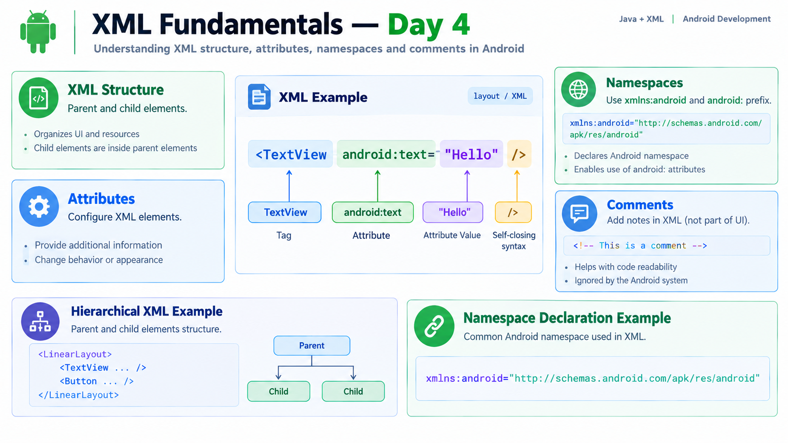

# XML Fundamentals — Day 4

## Overview

Day 4 focused on the fundamentals of XML used for creating Android user interfaces.

## Topics Learned

### 1. XML

XML stands for **Extensible Markup Language**.

In Android development, XML is commonly used to describe the structure of user interfaces.

The basic separation is:

**Java → Application logic and behavior**

**XML → User interface structure**

### 2. XML Tags

XML uses tags to define elements.

Examples:

`<TextView />`

`<Button />`

The name inside the angle brackets is the **tag name**.

For example:

`<TextView />`

**TextView** is the tag.

### 3. XML Attributes

Attributes provide additional information or configuration for an XML element.

Example:

`<TextView android:text="Hello" />`

Here:

- `TextView` → Tag
- `android:text` → Attribute
- `"Hello"` → Attribute value

An element can have multiple attributes.

Example:

`<Button android:text="Login" android:enabled="true" />`

### 4. XML Structure

Android XML has a hierarchical structure.

An XML element can contain other elements.

This creates a parent-child relationship:

**Parent Element**
→ Child Element
→ Child Element

This structure is used to represent the hierarchy of an Android UI.

### 5. XML Namespaces

Android XML files use namespaces to identify groups of attributes.

A common namespace declaration is:

`xmlns:android="http://schemas.android.com/apk/res/android"`

This declares the `android` namespace.

It allows Android attributes to use the `android:` prefix.

Examples:

`android:text`

`android:id`

`android:layout_width`

### 6. XML Comments

XML comments are used to add notes for developers.

Syntax:

`<!-- This is a comment -->`

Comments are not displayed as part of the application's UI.

### 7. Self-Closing Tags

An XML element that does not contain child elements can use a self-closing tag.

Example:

`<TextView />`

Instead of:

`<TextView></TextView>`

The `/` before `>` indicates that the element is self-closing.

## Key Understanding

**XML** → Describes UI structure

**Tag** → Defines an XML element

**Attribute** → Configures an element

**Namespace** → Defines prefixes such as `android:`

**Comment** → Developer note that is not displayed in the UI

**Self-closing tag** → Element without child content

## Day 4 Outcome

By the end of Day 4, I understood the basic syntax and structure of Android XML, including tags, attributes, namespaces, comments, and self-closing tags.

The concepts were tested through multiple-choice checkpoints, achieving **5/5** in the final checkpoint.