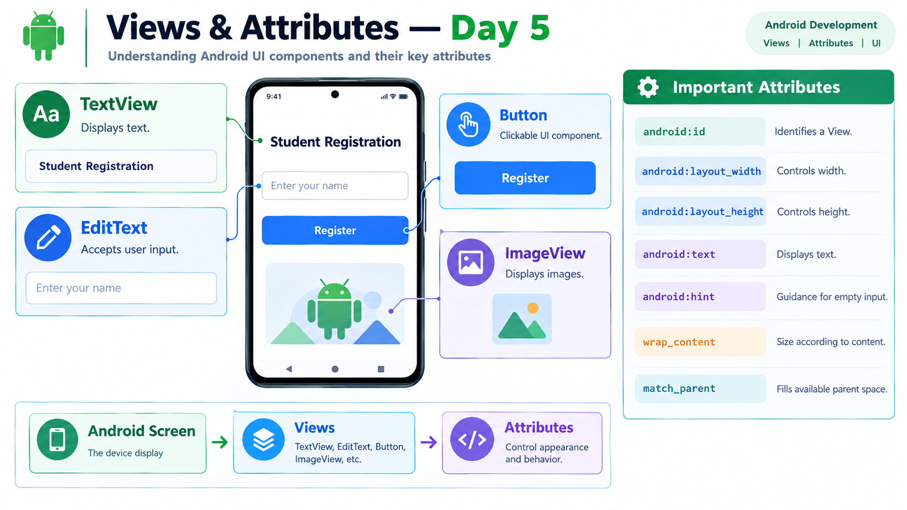

# Day 5 — Views & Attributes

## 📌 Overview

Today I learned about the basic Android UI components called **Views** and the important XML attributes used to configure them.

Views are the building blocks of an Android user interface.

---

## 🎯 Topics Covered

- TextView
- EditText
- Button
- ImageView
- View IDs
- Width and Height
- Text
- Hint
- wrap_content
- match_parent

---

## 1. TextView

`TextView` is used to display text on the Android screen.

Example concept:

`TextView → displays → "Student Registration"`

The `android:text` attribute is commonly used to specify the displayed text.

---

## 2. EditText

`EditText` allows the user to enter text.

It is commonly used for:

- Name
- Email
- Password
- Mobile number
- Other user input

The `android:hint` attribute provides guidance when the input field is empty.

Example:

`android:hint="Enter your name"`

### Text vs Hint

- `text` → actual text displayed in the View
- `hint` → guidance shown when the input is empty

---

## 3. Button

`Button` is a clickable UI component used to perform an action.

Example:

`android:text="Register"`

A button can later be connected to Java click-handling logic.

---

## 4. ImageView

`ImageView` is used to display images on the Android screen.

Examples:

- Application logo
- Profile image
- Icons
- Other image resources

Images can be stored in Android resource folders such as `drawable`.

---

## 5. View ID

The `android:id` attribute gives a View an identifier.

Example:

`android:id="@+id/registerButton"`

The ID allows the View to be referenced later from Java code.

---

## 6. Width and Height

Every View generally needs:

- `android:layout_width`
- `android:layout_height`

Common values include:

### wrap_content

The View takes only the space required by its content.

### match_parent

The View takes the available space provided by its parent.

---

## 7. Important Attributes

| Attribute | Purpose |
|---|---|
| `android:id` | Identifies the View |
| `android:layout_width` | Controls width |
| `android:layout_height` | Controls height |
| `android:text` | Displays text |
| `android:hint` | Shows guidance for empty input |

---

## 🛠️ Practical Implementation

I created a simple Android screen containing:

- TextView — Student Registration
- EditText — Enter your name
- Button — Register
- ImageView — Image/Logo

I configured the Views using XML attributes such as:

- ID
- Width
- Height
- Text
- Hint

The application was successfully run and the UI was verified on the device/emulator.

---

## 🧠 Key Understanding

Android UI is built using Views.

The basic relationship is:

**Screen → Views → Attributes**

For example:

**Button**
→ View

**android:text="Register"**
→ Attribute

**"Register"**
→ Attribute value

---

## ✅ Day 5 Outcome

After completing Day 5, I can:

- Identify common Android Views
- Use TextView to display text
- Use EditText for user input
- Use Button for clickable UI elements
- Use ImageView to display images
- Assign IDs to Views
- Configure width and height
- Understand `wrap_content` and `match_parent`