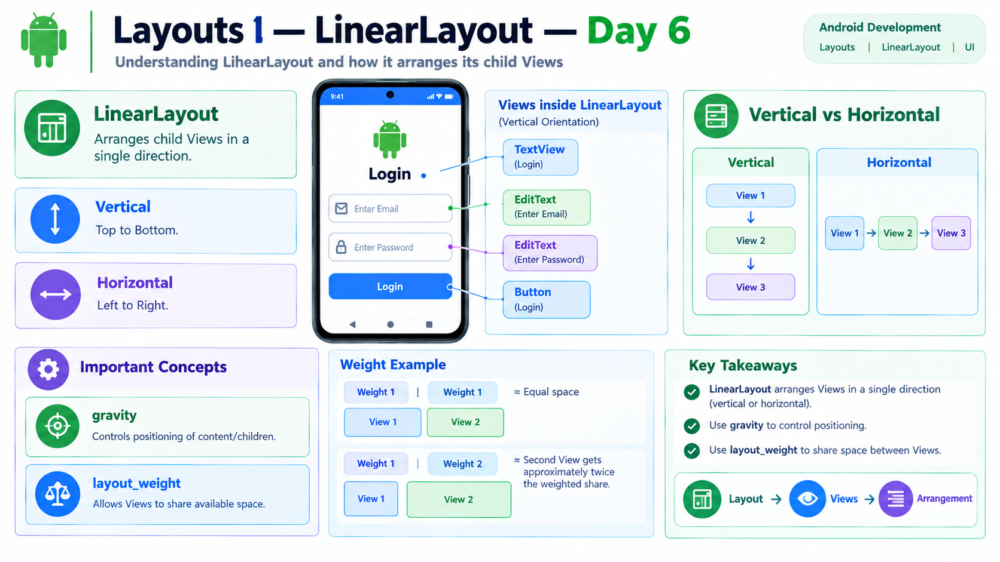

# Day 6 — Layouts I: LinearLayout

## 📌 Overview

Today I learned how Android Views are arranged on a screen using layouts, with a focus on `LinearLayout`.

A layout acts as a container for Views and controls how those Views are positioned.

---

## 🎯 Topics Covered

* Layout concept
* LinearLayout
* Vertical orientation
* Horizontal orientation
* Gravity
* layout_weight
* Basic screen design

---

## 1. Layout

A Layout is a container that holds and arranges Views.

Basic relationship:

**Layout → contains Views → arranges Views**

For example:

**LinearLayout**
→ TextView
→ EditText
→ Button

---

## 2. LinearLayout

`LinearLayout` arranges its child Views in a single direction.

The direction is controlled using:

`android:orientation`

There are two main orientations:

### Vertical

Views are arranged from top to bottom.

**TextView**

↓

**EditText**

↓

**Button**

### Horizontal

Views are arranged from left to right.

**Button → Button → Button**

---

## 3. Gravity

`android:gravity` is used to control the positioning of content or child Views within a View or Layout.

Common values include:

* `center`
* `center_horizontal`
* `center_vertical`
* `top`
* `bottom`

For example:

`android:gravity="center"`

can position content/children toward the center of the available area.

### Important distinction

* `gravity` → positioning of content/children inside a View or Layout
* `layout_gravity` → positioning of a View inside its parent

---

## 4. layout_weight

`layout_weight` allows Views inside a LinearLayout to share available space.

For example:

**View A → weight 1**

**View B → weight 1**

The weighted space can be divided approximately equally.

With:

**View A → weight 1**

**View B → weight 2**

View B receives approximately twice the weighted share of View A.

### Key idea

**weight = share of available space**

---

## 5. Basic Screen Design

LinearLayout can be used to create simple screen structures.

For example, a basic login screen can use:

**LinearLayout — vertical**

↓
**TextView — Login**

↓
**EditText — Email**

↓
**EditText — Password**

↓
**Button — Login**

The vertical orientation places each View below the previous View.

---

## 🛠️ Practical Implementation

I created a simple Login screen using `LinearLayout`.

The screen contained:

* TextView — Login
* EditText — Email
* EditText — Password
* Button — Login

I used:

* LinearLayout
* Vertical orientation
* Width and height attributes
* Gravity
* Basic View arrangement

The application was successfully run and the layout was verified on the device/emulator.

---

## 🧠 Key Understanding

The basic layout relationship is:

**Layout → Views → Arrangement**

For LinearLayout:

**Vertical → Top to Bottom**

**Horizontal → Left to Right**

**Gravity → Positioning**

**layout_weight → Sharing Available Space**

---

## ✅ Day 6 Outcome

After completing Day 6, I can:

* Explain what a Layout is
* Use LinearLayout
* Arrange Views vertically
* Arrange Views horizontally
* Understand `android:orientation`
* Understand `android:gravity`
* Understand `layout_weight`
* Create a basic screen using LinearLayout