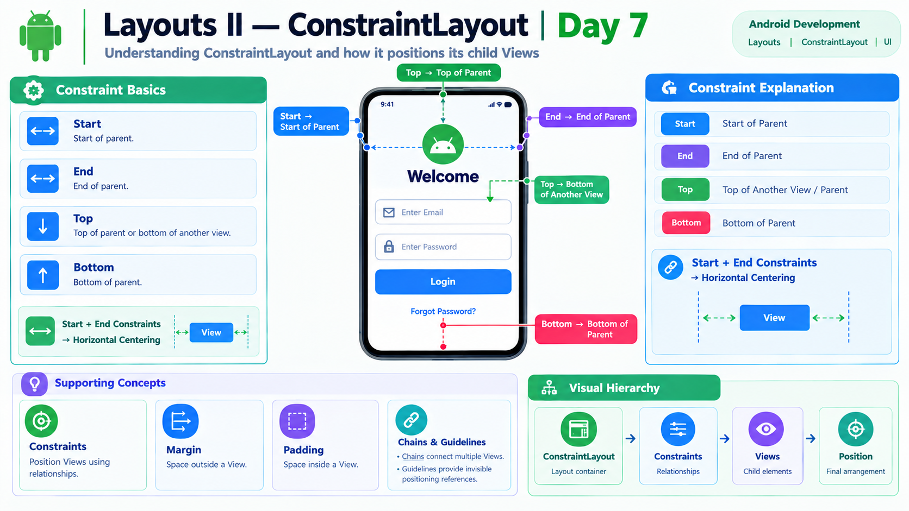

# Day 7 — Layouts II: ConstraintLayout



## Overview

ConstraintLayout is an Android layout that allows Views to be positioned using relationships called **constraints**.

Instead of arranging Views only from top to bottom or left to right, ConstraintLayout allows a View to be connected to the parent or to another View.

---

## Topics Learned

### 1. ConstraintLayout

ConstraintLayout is a ViewGroup used to create flexible Android screen layouts.

Example:

```xml
<androidx.constraintlayout.widget.ConstraintLayout
    android:layout_width="match_parent"
    android:layout_height="match_parent">
</androidx.constraintlayout.widget.ConstraintLayout>
```

---

### 2. Constraints

Constraints define where a View should be positioned.

The main sides are:

* Top
* Bottom
* Start
* End

A constraint follows this pattern:

```text
mySide_to_targetSide
```

Example:

```xml
app:layout_constraintStart_toStartOf="parent"
```

Meaning:

> Connect this View's Start side to the parent's Start side.

Another example:

```xml
app:layout_constraintTop_toBottomOf="@id/email"
```

Meaning:

> Connect this View's Top side to the Bottom of the Email View.

---

## Common Constraints

### Center Horizontally

```xml
app:layout_constraintStart_toStartOf="parent"
app:layout_constraintEnd_toEndOf="parent"
```

This allows a `wrap_content` View to be centered horizontally.

### Place a View Below Another View

```xml
app:layout_constraintTop_toBottomOf="@id/email"
```

### Place a View at the Top

```xml
app:layout_constraintTop_toTopOf="parent"
```

---

## 3. Margin

Margin is the space outside a View.

Example:

```xml
android:layout_marginTop="16dp"
```

It creates space between the View and the View or constraint above it.

---

## 4. Padding

Padding is the space inside a View.

Example:

```xml
android:padding="16dp"
```

### Difference

```text
Margin  → Outside the View
Padding → Inside the View
```

---

## 5. Chains

A chain is a group of Views connected through constraints.

Chains can be used to control how multiple Views share available space.

---

## 6. Guidelines

A guideline is an invisible reference line used to help position Views consistently.

It does not appear in the final application UI.

---

## Practical Work

Created a Login/Welcome screen using ConstraintLayout.

The screen contained:

* Welcome TextView
* Email EditText
* Password EditText
* Login Button
* Forgot Password TextView

The Views were positioned using:

* Start/End constraints
* Top/Bottom constraints
* View-to-View constraints
* Parent constraints
* Margins
* Padding

The application was successfully run and tested.

---

## Key Learning

The most important concept learned today is:

> **ConstraintLayout positions Views by connecting their sides to the parent or to other Views.**

For example:

```xml
app:layout_constraintTop_toBottomOf="@id/password"
```

means:

**My Top → Password Bottom**

And:

```xml
app:layout_constraintStart_toStartOf="parent"
app:layout_constraintEnd_toEndOf="parent"
```

means:

**My Start → Parent Start**

**My End → Parent End**

---