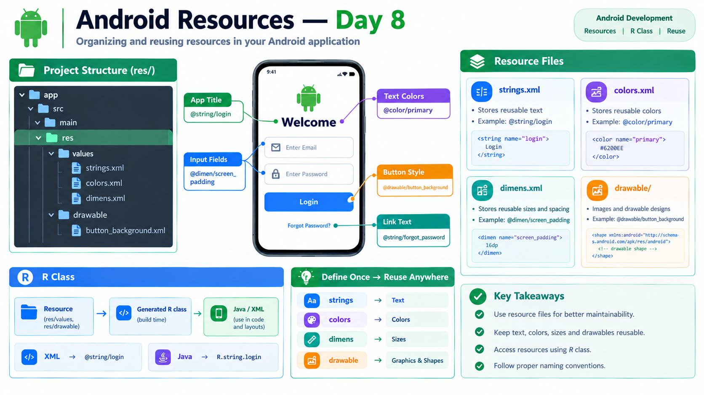

# Day 8 — Android Resources



## Overview

Android Resources are reusable values and files used by an Android application.

Instead of writing the same text, color, size, or drawable information repeatedly inside layouts, Android allows these resources to be stored separately and referenced when needed.

---

## Topics Learned

### 1. `strings.xml`

Used to store reusable text values.

Location:

```text
res/
└── values/
    └── strings.xml
```

Example:

```xml
<string name="login">Login</string>
```

Use in XML:

```xml
android:text="@string/login"
```

---

### 2. `colors.xml`

Used to store reusable colors.

Example:

```xml
<color name="primary">#2196F3</color>
```

Use:

```xml
android:textColor="@color/primary"
```

or:

```xml
android:background="@color/primary"
```

---

### 3. `dimens.xml`

Used to store reusable dimensions such as padding, margins, and View sizes.

Example:

```xml
<dimen name="screen_padding">16dp</dimen>
```

Use:

```xml
android:padding="@dimen/screen_padding"
```

---

### 4. Drawable Resources

The `drawable` directory is used for drawable resources such as:

* Images
* Shape backgrounds
* Custom drawable XML files

Example:

```text
res/
└── drawable/
    └── button_background.xml
```

A shape drawable can be used as a background:

```xml
android:background="@drawable/button_background"
```

---

## 5. Resource IDs

Android creates references for resources so they can be accessed throughout the application.

Examples:

```text
@string/login
@color/primary
@dimen/screen_padding
@drawable/button_background
```

The `@` indicates that the value is coming from an Android resource.

---

## 6. Generated `R` Class

Android generates an `R` class containing references to application resources.

Examples:

```java
R.string.login
R.color.primary
R.dimen.screen_padding
R.drawable.button_background
```

This connects the resources with Java code.

---

## XML vs Java Resource References

The same resource can be accessed differently depending on where it is being used.

### XML

```xml
android:text="@string/login"
```

### Java

```java
String text = getString(R.string.login);
```

Therefore:

```text
XML  → @string/login
Java → R.string.login
```

---

## Practical Work

Created and tested reusable string resources:

```xml
<string name="day8_title">Android Resources</string>
<string name="day8_button">Continue</string>
```

Used them in the XML layout:

```xml
android:text="@string/day8_title"
```

and:

```xml
android:text="@string/day8_button"
```

The application was successfully run and the resources displayed correctly.

---

## Key Learning

Android resources help keep applications:

* Organized
* Reusable
* Easier to maintain
* Consistent across screens

The main resource structure learned today:

```text
strings.xml  → Text
colors.xml   → Colors
dimens.xml   → Sizes
drawable/    → Images and drawable designs
```

And Android provides generated references through the `R` class.

---