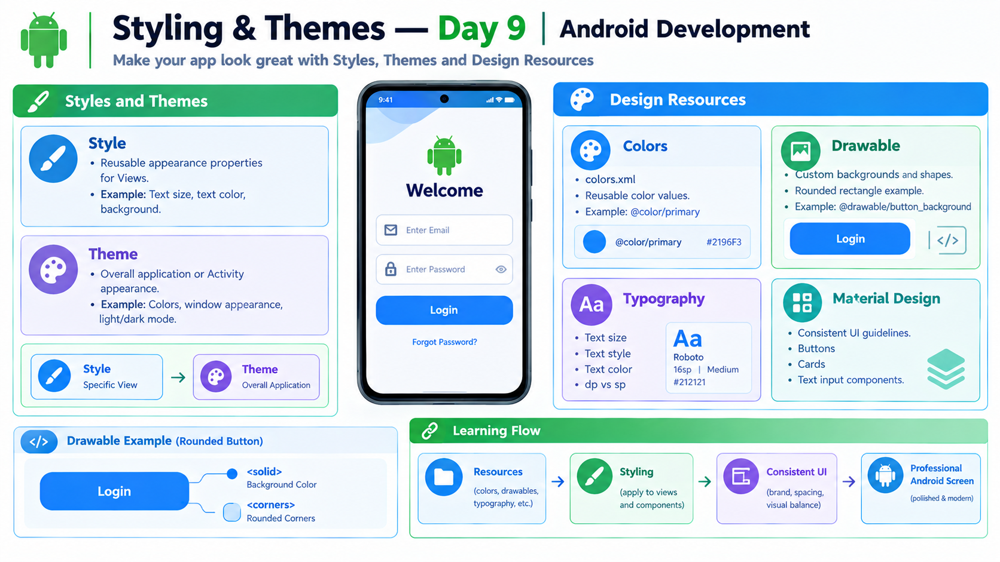

# Day 9 — Styling and Themes



## Overview

Android styling and themes help create a consistent and professional user interface.

In this day, I learned how to use styles, themes, colors, drawable backgrounds, typography, and Material Design basics.

---

## Topics Learned

### 1. Styles

A Style is a reusable collection of appearance properties that can be applied to Views.

Examples of styling properties:

* Text size
* Text color
* Background
* Text style
* Other View appearance attributes

Example:

```xml
<style name="MyButtonStyle">
    <item name="android:textSize">18sp</item>
    <item name="android:textColor">#FFFFFF</item>
</style>
```

A style helps avoid repeating the same appearance properties across multiple Views.

---

### 2. Themes

A Theme defines the overall appearance of an Android application or Activity.

Themes can control:

* Application colors
* Window appearance
* Default UI appearance
* Light and dark mode behavior

### Difference Between Style and Theme

| Style                                       | Theme                                   |
| ------------------------------------------- | --------------------------------------- |
| Usually applied to a View or group of Views | Applied to an application or Activity   |
| Controls specific appearance properties     | Controls overall application appearance |
| Example: Button text size and color         | Example: App color scheme               |

---

### 3. Colors

Colors can be stored in `colors.xml` for reuse.

Location:

```text
res/values/colors.xml
```

Example:

```xml
<color name="primary">#2196F3</color>
<color name="white">#FFFFFF</color>
<color name="dark_text">#212121</color>
```

Use in XML:

```xml
android:textColor="@color/primary"
```

Using color resources helps maintain consistent colors throughout the application.

---

### 4. Drawable Backgrounds

Drawable resources can be used for images, shapes, and custom backgrounds.

Created a rounded rectangle background for the Login Button.

File:

```text
res/drawable/button_background.xml
```

Example:

```xml
<?xml version="1.0" encoding="utf-8"?>
<shape xmlns:android="http://schemas.android.com/apk/res/android"
    android:shape="rectangle">

    <solid android:color="@color/primary" />

    <corners android:radius="12dp" />

</shape>
```

### Important Elements

* `<shape>` defines the drawable shape.
* `<solid>` sets the background color.
* `<corners>` creates rounded corners.

Applied to the Button:

```xml
android:background="@drawable/button_background"
```

---

### 5. Typography

Typography describes how text appears in the application.

Important properties include:

* Text size
* Text color
* Text style
* Font weight
* Text alignment

Example:

```xml
android:textSize="24sp"
android:textStyle="bold"
android:textColor="@color/dark_text"
```

### dp vs sp

| Unit | Main Use                                   |
| ---- | ------------------------------------------ |
| dp   | Layout dimensions, spacing, and View sizes |
| sp   | Text size                                  |

`sp` is designed to respect the user's font-size preference.

---

### 6. Material Design Basics

Material Design is a design system that provides UI guidelines and components for creating consistent interfaces.

Examples of Material components:

* Material Buttons
* Text input components
* Cards
* Floating Action Buttons
* Material themes

Material Design focuses on consistent appearance, interaction, and usability.

---

## Practical Work

Improved the existing Login screen using styling and theme-related concepts.

### Implemented

* Reusable colors from `colors.xml`
* Custom drawable background
* Rounded Login Button
* Blue Button background
* White Button text
* Larger and bold Welcome text
* Text sizing using `sp`
* Existing ConstraintLayout positioning

### Button Styling

```xml
<Button
    android:id="@+id/login"
    android:layout_width="wrap_content"
    android:layout_height="wrap_content"
    android:text="Login"
    android:textColor="@color/white"
    android:textSize="16sp"
    android:background="@drawable/button_background"
    android:backgroundTint="@null"
    app:layout_constraintStart_toStartOf="parent"
    app:layout_constraintEnd_toEndOf="parent"
    app:layout_constraintTop_toBottomOf="@id/pass" />
```

The Login Button was successfully styled and tested in the Android application.

---

## Key Learning

The main concepts learned today are:

```text
Style  → Reusable View appearance
Theme  → Overall application appearance
Color  → Reusable colors
Drawable → Custom backgrounds and shapes
Typography → Text appearance
Material Design → UI guidelines and components
```

A professional Android interface uses consistent colors, spacing, typography, and reusable design resources.

---