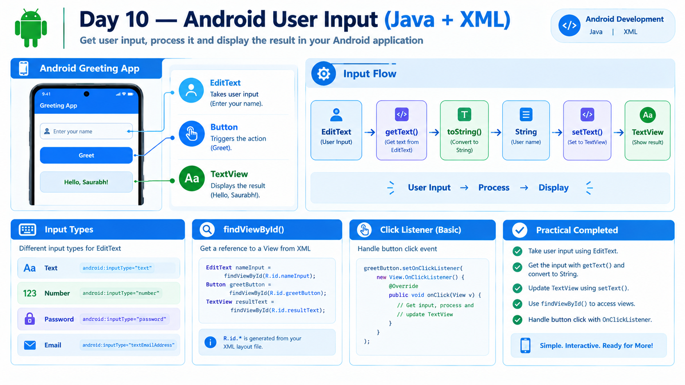

# Day 10 — User Input in Android




## 📅 Learning Overview

**Day:** 10

**Topic:** User Input

**Technology:** Java + XML

## 📚 Concepts Learned

1. **EditText**

   * Used to accept user input.
   * Connected to Java using `findViewById()`.

2. **Reading Input**

   * `getText()` reads the current input.
   * `toString()` converts the input into a Java String.

3. **Displaying Text**

   * `setText()` updates the text of a TextView.

4. **Input Types**

   * `text` — Normal text.
   * `number` — Number-friendly input.
   * `textPassword` — Password input.
   * `textEmailAddress` — Email input.

5. **Click Listener Introduction**

   * A listener responds to an event.
   * `setOnClickListener()` executes code when a button is clicked.
   * Lambda expressions provide a short listener syntax.

## 🛠️ Practical Completed

### Greeting App

Created a simple greeting application using:

* EditText for entering a name.
* Button for triggering the greeting.
* TextView for displaying the result.
* Java click listener for reading and displaying the input.

### Example

**Input:**

```text
Saurabh
```

**Output:**

```text
Hello, Saurabh!
```