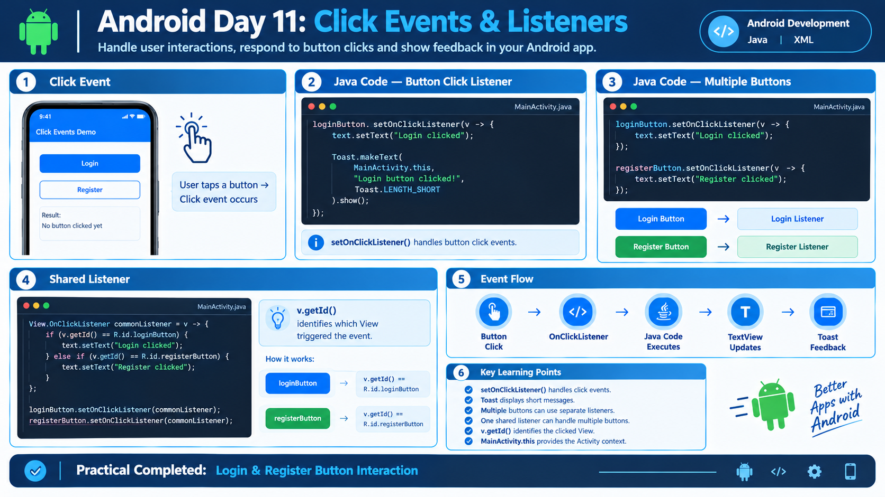

# Day 11: Click Events and Listeners




## 📌 Overview

Today I learned how to handle user interactions in Android applications using Java event listeners.

## 📚 Topics Covered

### 1. Click Events

A click event occurs when the user taps a View, such as a Button.

Examples:

* Login button click
* Register button click
* Submit button click

### 2. OnClickListener

`View.OnClickListener` is used to handle click events.

The `setOnClickListener()` method attaches a click listener to a View.

```java
loginButton.setOnClickListener(v -> {
    text.setText("Login clicked");
});
```

### 3. Toast Messages

A Toast displays a short message to the user.

```java
Toast.makeText(
        MainActivity.this,
        "Button clicked!",
        Toast.LENGTH_SHORT
).show();
```

### 4. Multiple Button Listeners

Different buttons can have their own listeners.

```java
loginButton.setOnClickListener(v -> {
    text.setText("Login clicked");
});

registerButton.setOnClickListener(v -> {
    text.setText("Register clicked");
});
```

### 5. Shared Listener

One listener can be assigned to multiple buttons.

```java
View.OnClickListener commonListener = v -> {
    if (v.getId() == R.id.loginButton) {
        text.setText("Login clicked");
    } else if (v.getId() == R.id.registerButton) {
        text.setText("Register clicked");
    }
};

loginButton.setOnClickListener(commonListener);
registerButton.setOnClickListener(commonListener);
```

`v.getId()` identifies which View triggered the event.

## 🛠️ Practical Implementation

Created a simple Android application containing:

* Login button
* Register button
* TextView for displaying output
* Toast messages for button interactions
* Separate and shared click listeners

### Application Flow

1. User clicks the Login button.
2. The click listener executes.
3. The TextView displays the Login message.
4. A Toast message is shown.

The same flow is implemented for the Register button.

## 💡 Key Learnings

* A listener handles user interactions.
* `setOnClickListener()` handles button clicks.
* Multiple buttons can have separate listeners.
* One shared listener can handle multiple buttons.
* `v.getId()` identifies the clicked View.
* `Toast` displays short feedback messages.
* `MainActivity.this` provides the Activity context to Toast.