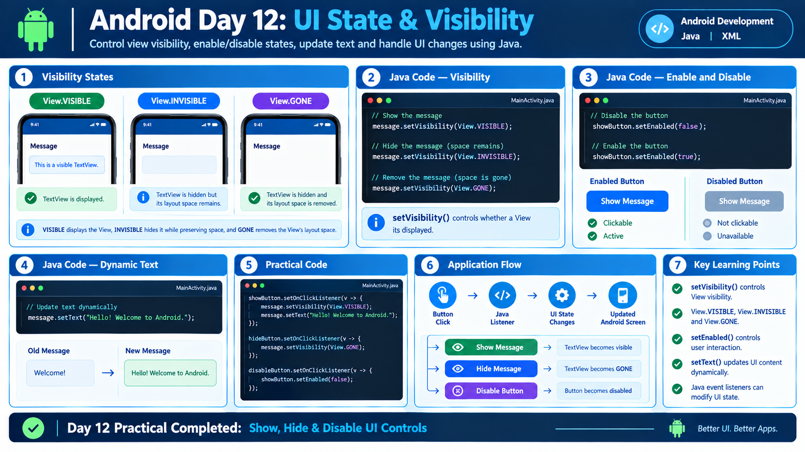

# Day 12: UI State and Visibility



## 📌 Overview

Today I learned how to control the visibility, enabled state, and displayed content of Android UI elements using Java.

## 📚 Topics Covered

### 1. View Visibility

The `setVisibility()` method controls whether a View is displayed.

| Value            | Description                                 |
| ---------------- | ------------------------------------------- |
| `View.VISIBLE`   | Displays the View                           |
| `View.INVISIBLE` | Hides the View but keeps its layout space   |
| `View.GONE`      | Hides the View and removes its layout space |

```java
message.setVisibility(View.VISIBLE);
message.setVisibility(View.INVISIBLE);
message.setVisibility(View.GONE);
```

### 2. Enabling and Disabling Views

The `setEnabled()` method controls whether a user can interact with a View.

```java
showButton.setEnabled(false);
showButton.setEnabled(true);
```

### 3. Changing Text Dynamically

The `setText()` method changes the text displayed in a TextView.

```java
message.setText("Welcome to Android!");
```

## 🛠️ Practical Implementation

Created a UI containing:

* A TextView for displaying a message
* A Show Message button
* A Hide Message button
* A Disable Button button

### Java Implementation

```java
showButton.setOnClickListener(v -> {
    message.setVisibility(View.VISIBLE);
    message.setText("Hello! Welcome to Android.");
});

hideButton.setOnClickListener(v -> {
    message.setVisibility(View.GONE);
});

disableButton.setOnClickListener(v -> {
    showButton.setEnabled(false);
});
```

## 🔄 Application Flow

1. The user clicks the Show Message button.
2. The message becomes visible and its text is updated.
3. The user clicks the Hide Message button.
4. The message becomes hidden.
5. The user clicks the Disable Button button.
6. The Show Message button becomes disabled.

## 💡 Key Learnings

* `setVisibility()` controls the visibility of a View.
* `View.GONE` removes the View's layout space.
* `View.INVISIBLE` keeps the View's layout space.
* `setEnabled(false)` disables user interaction.
* `setText()` changes displayed content dynamically.
* Java click listeners can update the UI during runtime.